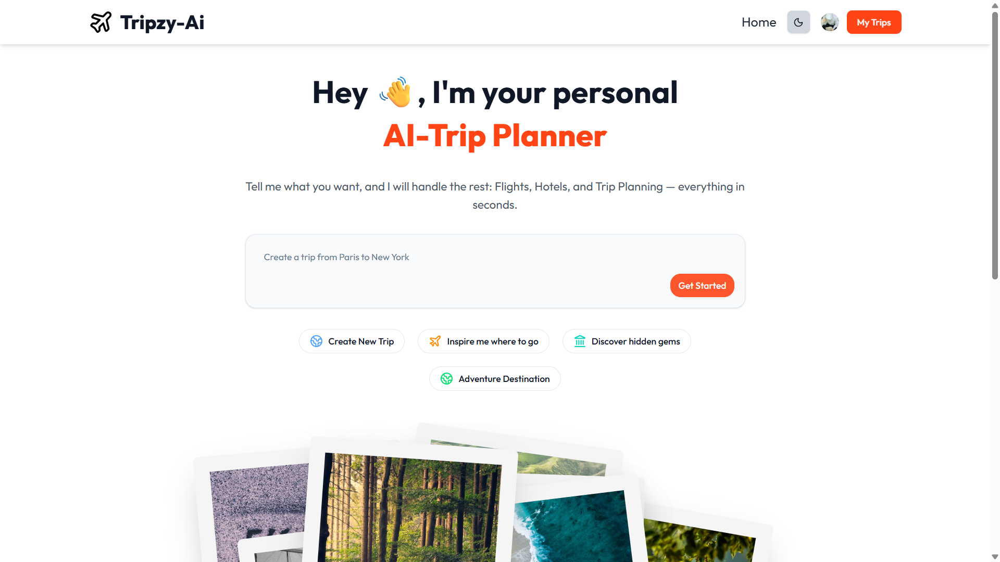
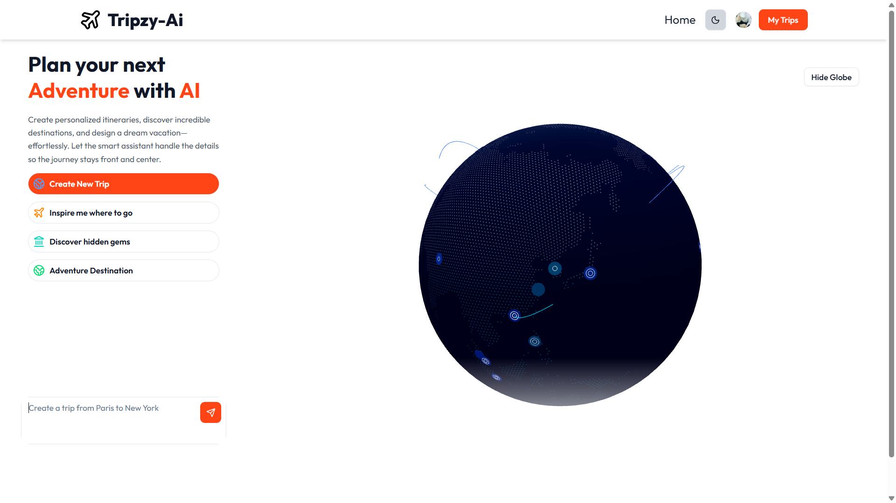
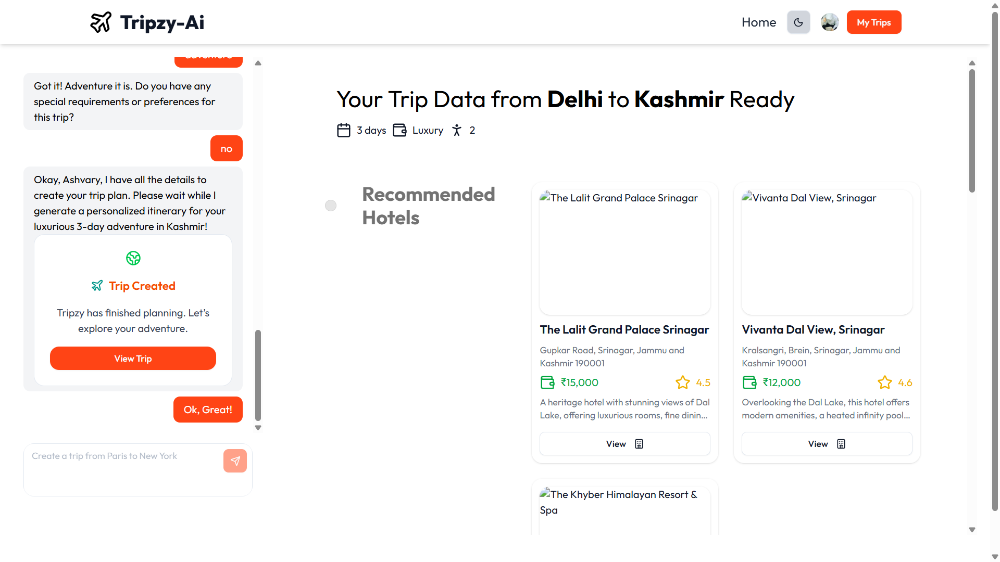
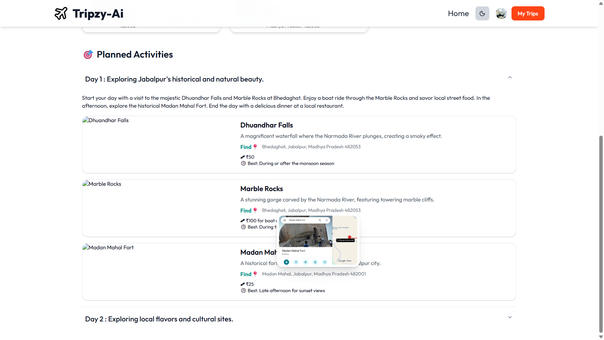
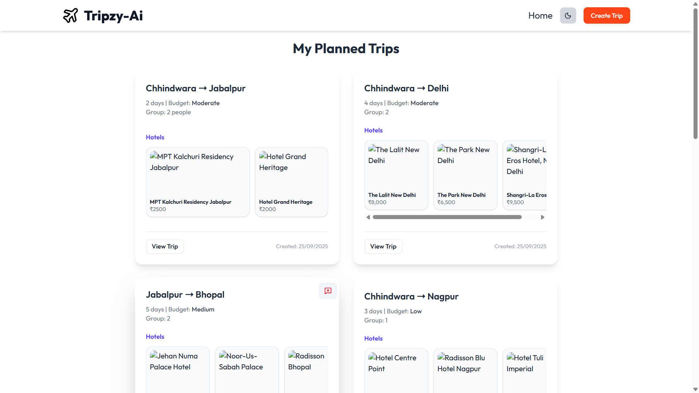
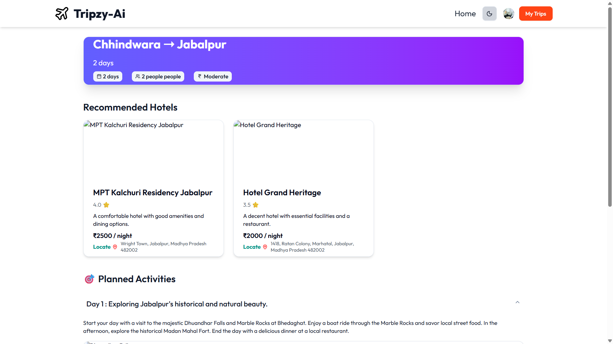
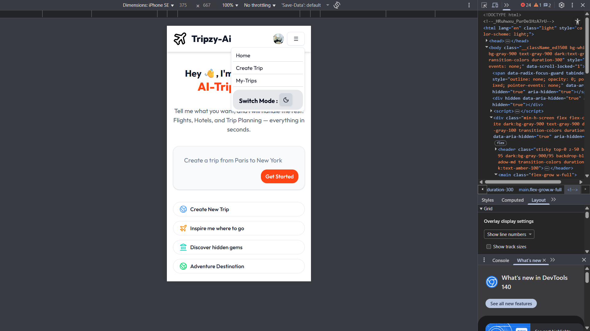

# 🌍 Tripzy-AI : https://tripzy-ai.vercel.app/

> ✈️ **_AI-Powered Trip Planner_**

**Plan your dream journey effortlessly with our intelligent travel assistant powered by Google Gemini. Through an interactive chatbot, you can explore destinations, find the best hotels tailored to your budget, group size, and preferences, and generate personalized day-by-day itineraries.**

🔗 [**Live Demo**](https://tripzy-ai.vercel.app/)

---

# Tech Used

[](https://nextjs.org/)  
[](https://reactjs.org/)  
[](https://www.typescriptlang.org/)  
[](https://tailwindcss.com/)  
[](https://www.mongodb.com/)  
[](https://clerk.com/)  
[](https://www.langchain.com/)  
[](https://threejs.org/)

---

## 🚀 Features

- **🛫 AI-Powered Trip Planning** – Complete trip planning – itineraries, flights, hotels, and local recommendations .
- **💬 Interactive Chatbot** – Plan your trip through a natural conversation flow.
- **🔐 User Authentication** – Secure sign-in/sign-up powered by **Clerk**.
- **📂 Trip Management** – Save, view, and manage your trips in **MongoDB**.
- **🌐 3D Globe Visualization** – Explore destinations interactively with **Three.js**.
- **🗺️Hotel** – 🗺️ Direct hotel addresses and Google Maps integration with photos

- **🛡️ Rate Limiting** – Prevents abuse using **Arcjet**.
- **🌙 Dark Mode / Responsive Design** – Dark mode support & responsive design for all devices.
  .

---
 
## 📸 Screenshots 

| Home Page | Chatbot+Globe | Planned Trip Side View |
|-----------|---------|-----------------|
|  |  |  |

| Day Activity | My Trips | Trip Details |
|--------------|----------|--------------|
|  |  |  |

| Mobile View |
|-------------|
|  |

---

## 🛠️ Tech Stack

- **Frontend**: Next.js 15, React 19, TypeScript, Tailwind CSS , AccertinityUi, ShadCn
- **Backend**: Next.js API Routes
- **AI**: LangChain + Google Gemini (Gemini 2.0 Flash)
- **Database**: MongoDB + Mongoose
- **Authentication**: Clerk
- **3D Graphics**: Three.js + React Three Fiber
- **Rate Limiting**: Arcjet
- **Deployment**: Vercel

---

## 📋 Prerequisites

- Node.js **18+**
- MongoDB database
- Google Gemini API key
- Clerk account (for authentication)

---

## ⚡ Installation

1. **Clone the repo**

   ```bash
   git clone https://github.com/Ashvary1996/TripzyAi.git
   cd tripzy_ai

   ```

2. **Install dependencies**

   ```bash
    npm install

   ```

3. **Setup environment variables**

   Create .env.local in project root:

   ```bash
    MONGODB_URI=your_mongodb_connection_string
    GOOGLE_API_KEY=your_google_gemini_api_key
    NEXT_PUBLIC_CLERK_PUBLISHABLE_KEY=your_clerk_publishable_key
    CLERK_SECRET_KEY=your_clerk_secret_key
    NEXT_PUBLIC_CLERK_SIGN_IN_URL=/sign-in
    NEXT_PUBLIC_CLERK_SIGN_UP_URL=/sign-up
    NEXT_PUBLIC_CLERK_AFTER_SIGN_IN_URL=/
    NEXT_PUBLIC_CLERK_AFTER_SIGN_UP_URL=/

   ```

4. **Run the dev server**
   ```bash
    npm run dev
   ```
5. **Visit 👉 http://localhost:3000**

## 🔌 API Reference

- AI Trip Planning Endpoint
  - URL: /api/ai
  - Method: POST
  - Request Body:
- Response: AI-generated trip planning JSON

## 🙏 Acknowledgments

- Google Gemini – AI trip planning power
- Clerk – Authentication & session management
- Three.js – 3D globe visualization
- LangChain – AI orchestration
- All contributors & open-source libraries ❤️
